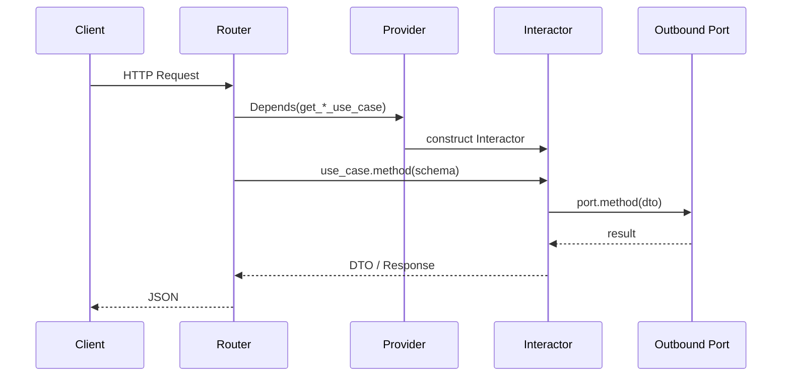

# Titanic 아키텍처 참조 가이드

`backend/apps/titanic/` 에서 검증한 **Hexagonal + DDD + Vertical Slice** 레이아웃입니다.  
다른 도메인 앱(`automata`, `ontology`, `audio` …)을 만들 때 이 문서를 **복제·참조 템플릿**으로 쓰면 됩니다.

> **관련 문서**
> - 도메인 규칙·API 계약: [`CLAUDE.md`](CLAUDE.md)
> - 파일 트리·캐릭터 목록: [`타이타닉폴더구조.md`](타이타닉폴더구조.md)
> - 백엔드 공통 규칙: [`../../../CLAUDE.md`](../../../CLAUDE.md)

---

## 1. 이 아키텍처가 풀려 주는 것

| 문제 | Titanic 방식의 답 |
|------|-------------------|
| 라우터에 비즈니스 로직이 섞임 | Router는 HTTP만, 로직은 `use_cases/` |
| DB·LLM·CSV가 도메인에 침투 | `adapter/outbound/` 에만 둠 |
| 기능 추가 시 파일 위치 혼란 | **캐릭터 stem** 하나로 세로 슬라이스 통일 |
| 테스트·교체 어려움 | Port(ABC)로 구현체 교체 |
| FastAPI `Depends`가 everywhere | `dependencies/*_provider.py` 한곳에 모음 |

**한 줄 요약:** 바깥(I/O)과 안쪽(규칙)을 벽으로 나누고, 기능 단위로 **같은 이름의 파일 세트**를 반복한다.

---

## 2. 핵심 원칙

### 2.1 Hexagonal (Ports & Adapters)

```text
        [ HTTP / gRPC / WS ]          ← adapter/inbound
                 │
         app/ports/input (UseCase)
                 │
           app/use_cases
                 │
        app/ports/output (Port)
                 │
    [ PG / ORM / CSV / Claude / sklearn ]  ← adapter/outbound
```

- **Inbound adapter:** 요청을 받아 Use Case를 호출한다.
- **Application:** 워크플로·오케스트레이션만 담당한다.
- **Outbound adapter:** Port 인터페이스를 실제 기술로 구현한다.
- **Domain:** 프레임워크·DB·외부 SDK import 금지.

### 2.2 Vertical Slice (기능 단위 세로 절단)

Titanic은 **캐릭터 1명 = 기능 슬라이스 1개**다.

```text
crew_smith_captain  →  chat, myself, 오케스트레이션
passenger_rose_model →  train, predict, introduce_myself
crew_walter_roaster  →  CSV train/test 제공
```

다른 프로젝트에서는 `crew_*` / `passenger_*` 대신 도메인에 맞는 접두사를 쓴다.

| Titanic | 다른 앱 예시 |
|---------|-------------|
| `crew_smith_captain` | `automata/faker_mailer` |
| `passenger_rose_model` | `ontology/spam_classifier` |
| `crew_walter_roaster` | `audio/feature_extractor` |

**규칙:** 슬라이스마다 **동일한 stem**을 파일명에 반복한다.

### 2.3 의존성 방향 (반드시 지킬 것)

```text
adapter/inbound  →  app  →  domain
adapter/outbound →  app  (domain은 outbound를 모른다)
dependencies     →  adapter + app (조립만)
main.py          →  router_registry만 등록
```

| 금지 | 이유 |
|------|------|
| `domain` → `fastapi`, `sqlalchemy` | 순수 모델 오염 |
| `use_cases` 안에 `Depends()` | 테스트·재사용 불가 |
| `adapter` 끼리 직접 import | 레이어 우회 |
| 앱 간 adapter 직접 참조 | `core/` 또는 Port 경계로 공유 |

---

## 3. 레이어별 책임

### 3.1 `adapter/inbound/` — 들어오는 요청

| 하위 경로 | 역할 |
|-----------|------|
| `api/schemas/` | Pydantic 요청·응답 (`json_schema_extra` 예시 포함) |
| `api/v1/*_router.py` | FastAPI 라우트, `Depends(get_*_use_case)` |
| `api/router_registry.py` | 앱 단일 `APIRouter`에 하위 라우터 등록 |
| `grpc/v1/`, `websocket/v1/` | 확장 슬롯 (예약) |

**Router가 하는 일 (이것만):**

- HTTP 메서드·경로·status code
- Schema 파싱·`response_model`
- Use Case 호출 + 로깅
- `HTTPException` (프로젝트 관례에 맞는 `detail`)

**Router가 하지 않는 일:** DB 쿼리, ML 학습, 외부 API 호출.

### 3.2 `app/ports/input/` — Use Case 인터페이스

```python
class SmithCaptainUseCase(ABC):
    @abstractmethod
    async def chat(self, schema: ChatSchema) -> ChatResponse: ...
```

- Router·Interactor가 **같은 계약**을 공유한다.
- 테스트 시 Fake Use Case 주입이 쉽다.

### 3.3 `app/use_cases/` — Interactor (오케스트레이션)

- **한 슬라이스의 비즈니스 흐름**을 구현한다.
- 다른 Use Case를 **생성자 주입**으로 조합할 수 있다 (Smith 패턴).
- Port(출력)를 호출해 persistence·외부 서비스에 위임한다.

**Smith 오케스트레이터 예** — 한 Interactor가 여러 Use Case를 엮는다:

```text
SmithCaptainInteractor
  ├── Walter  → train/test CSV
  ├── Jack    → 10모델 학습
  ├── Rose    → 생존 예측
  ├── Cal     → test 평가
  ├── Andrews → Kiwi 의도 분석
  ├── Hartley → 상관·히트맵
  └── Repository → Claude 채팅 (outbound)
```

다른 프로젝트에서 “퍼사드/오케스트레이터”가 필요하면 **별도 슬라이스 하나**로 두고, provider에서 하위 Use Case를 `Depends`로 조립한다.

### 3.4 `app/ports/output/` — Outbound Port

```python
class SmithCaptainPort(ABC):
    @abstractmethod
    async def chat(self, schema: ChatSchema) -> str: ...
```

- **기술 중립** 이름 (`Port`, 과거 `Repository` 혼용 — 신규는 `*_port.py` 권장).
- PG·CSV·HTTP 클라이언트는 이 인터페이스 뒤에 숨긴다.

### 3.5 `adapter/outbound/` — 실제 I/O

| 하위 경로 | 역할 |
|-----------|------|
| `pg/*_repository.py` | AsyncSession + SQL |
| `orm/` | SQLAlchemy 모델, ML 전략 객체 |
| `mappers/` | Entity ↔ ORM/DTO 변환 |
| `client/` | (필요 시) HTTP·n8n 등 외부 API |

**Walter 패턴:** Port 구현체 안에서 `WalterReader`(CSV)를 감싼다. DB가 없어도 Port 형태는 유지한다.

### 3.6 `domain/` — 순수 도메인

| 하위 경로 | 역할 |
|-----------|------|
| `entities/` | 슬라이스·공통 엔티티 (`titanic_passenger_entity`) |
| `value_objects/` | **피처 단위** VO (`Age`, `Gender`, `Title` …) |

Titanic의 설계 포인트: VO는 **캐릭터별이 아니라 도메인 피처별**이다.  
캐릭터 VO 12개를 두지 않고, ML·검증이 공유하는 값 객체를 재사용한다.

### 3.7 `dependencies/` — DI 조립

```python
def get_smith_captain_use_case(
    repository: SmithCaptainPort = Depends(get_smith_captain_repository),
    jack: JackTrainerInteractor = Depends(get_jack_trainer_use_case),
    ...
) -> SmithCaptainUseCase:
    return SmithCaptainInteractor(repository=repository, jack=jack, ...)
```

- **유일한 `Depends` 허용 위치** (Router + provider).
- Interactor 생성자에 필요한 의존성을 명시적으로 나열한다.

### 3.8 `app/dtos/` — 애플리케이션 계층 데이터

| 종류 | 위치 | 용도 |
|------|------|------|
| **Schema** | `adapter/.../schemas/` | HTTP 경계 (FastAPI·OpenAPI) |
| **DTO** | `app/dtos/` | Use Case ↔ Port 내부 전달 |
| **Entity** | `domain/entities/` | 도메인 규칙·불변성 |
| **VO** | `domain/value_objects/` | 척도·검증이 있는 값 |

같은 필드라도 **레이어가 다르면 타입을 분리**한다. Schema를 Entity까지 관통시키지 않는다.

---

## 4. 슬라이스 파일 세트 (복제 템플릿)

새 기능 `{domain}_{role}` 을 추가할 때 아래 **stem을 통일**한다.

| # | 레이어 | 경로 |
|---|--------|------|
| 1 | Router | `adapter/inbound/api/v1/{stem}_router.py` |
| 2 | Schema | `adapter/inbound/api/schemas/{stem}_schema.py` |
| 3 | Input port | `app/ports/input/{stem}_use_case.py` |
| 4 | Output port | `app/ports/output/{stem}_port.py` |
| 5 | DTO | `app/dtos/{stem}_dto.py` |
| 6 | Interactor | `app/use_cases/{stem}_interactor.py` |
| 7 | Provider | `dependencies/{stem}_provider.py` |
| 8 | PG (선택) | `adapter/outbound/pg/{stem}_repository.py` |
| 9 | ORM (선택) | `adapter/outbound/orm/{stem}_orm.py` |
| 10 | Mapper (선택) | `adapter/outbound/mappers/{stem}_mapper.py` |
| 11 | Entity (선택) | `domain/entities/{stem}_entity.py` |

**최소 세트 (DB 없는 API):** 1–7번만으로도 동작한다 (Hartley CSV-only 등).

### 추가 체크리스트

1. `router_registry.py`에 `include_router` 한 줄
2. `main.py`는 앱 루트 router만 mount (도메인별 수정 최소화)
3. Schema에 `model_config = ConfigDict(json_schema_extra={"examples": [...]})`
4. `tests/` — entity·mapper·interactor 단위 (선택)

---

## 5. 요청 흐름 (표준)

```text
Client
  → POST /titanic/smith/chat
  → crew_smith_captain_router.chat()
  → Depends(get_smith_captain_use_case)
  → SmithCaptainInteractor.chat()
       → (필요 시) 다른 Use Case 호출
       → SmithCaptainPort.chat()  →  Claude / DB
  → ChatResponse
```



---

## 6. Titanic에서 검증된 패턴 모음

### 6.1 단일 Interactor에 ML + 캐릭터 (Rose)

- `RoseModelInteractor` 하나에 `train` / `predict` / `introduce_myself`
- 별도 `*_train_interactor` 로 쪼개지 않음
- sklearn 전략은 `adapter/outbound/orm/passenger_rose_model_strategies.py`

**다른 프로젝트 적용:** “모델 서빙 + 소개 API”가 한 bounded context면 Interactor 하나로 유지.

### 6.2 데이터 소스 추상화 (Walter)

- CSV 경로: `app/use_cases/crew_walter_roaster_reader.py`
- Port 구현: `WalterRoasterPgRepository`가 Reader를 내부에서 사용
- Jack/Rose/Cal은 Port만 알고 CSV 경로를 모른다

**다른 프로젝트 적용:** S3·로컬 파일·DB를 같은 Port 뒤에 교체.

### 6.3 상수·의도 맵 (Andrews)

- `app/constants/intent_map.py` — Kiwi 의도 → 내부 액션 enum
- Interactor는 상수만 참조, NLP SDK는 outbound

### 6.4 오케스트레이터 Provider (Smith)

- 가장 무거운 provider: 하위 Use Case 6개를 `Depends`로 주입
- **순환 의존 방지:** Smith → Jack → Walter 방향만; Jack이 Smith를 알지 않음

### 6.5 공통 도메인 모델

- `titanic_passenger_entity.py` — 여러 슬라이스가 공유
- `titanic_booking_mapper.py` — James 업로드·공통 응답

**다른 프로젝트 적용:** 여러 API가 같은 “주문”, “사용자”를 다루면 `domain/entities/`에 공통 엔티티 하나.

---

## 7. 앱 루트 등록 (모노레포)

```text
backend/
  main.py                    ← titanic_router, automata_router, … include만
  apps/
    titanic/                 ← 이 문서의 기준 앱
    automata/
    ontology/
  core/                      ← DB, Claude keymaker, Neo4j 등 공유 인프라
```

```python
# main.py (개념)
from titanic.adapter.inbound.api.router_registry import titanic_router
app.include_router(titanic_router)  # prefix /api 없이 /titanic/...
```

- Import: `from titanic.xxx` (`PYTHONPATH=apps`, `backend`·`apps` 생략)
- Cross-app: adapter 직접 import ❌ → `core/` 또는 명시적 API 경계

---

## 8. 새 도메인 앱 뼈대 만들기

Titanic을 **폴더 단위로 복사**한 뒤 이름만 바꾼다.

```text
backend/apps/{new_app}/
  adapter/inbound/api/router_registry.py
  adapter/inbound/api/v1/
  adapter/inbound/api/schemas/
  adapter/outbound/pg/          # DB 쓸 때만
  app/ports/input/
  app/ports/output/
  app/use_cases/
  app/dtos/
  dependencies/
  domain/entities/
  tests/
  _docs/
    CLAUDE.md                   # 도메인 규칙
    structure.md                # 이 문서 링크 또는 요약
```

1. 첫 슬라이스 1개만 end-to-end로 만든다 (router → interactor → port → repo).
2. `main.py`에 router 등록.
3. `/docs`에서 smoke test.
4. 두 번째 슬라이스부터 템플릿 복제.

---

## 9. 안티패턴 (Titanic에서 피한 것)

| 안티패턴 | 대신 |
|----------|------|
| `app/jack_service.py` 같은 레거시 단일 파일 | `use_cases/*_interactor.py` |
| 캐릭터마다 `*_vo.py` 12개 | 피처 VO 공유 |
| Router에서 `AsyncSession` 직접 사용 | Provider → Port |
| Interactor에서 `httpx` 직접 호출 | outbound client + Port |
| 전역 싱글톤 Rose 모델 | Provider가 Interactor 수명에 맞게 주입 |

레거시 파일(`jack_service.py`, `rose_model.py` 등)은 구조 이전 전 유산 — **신규 코드는 슬라이스 템플릿만** 따른다.

---

## 10. 테스트·검증 습관

| 대상 | 위치 예시 |
|------|-----------|
| VO·Entity 규칙 | `tests/domain/` |
| Mapper | `tests/adapter/outbound/mappers/` |
| Interactor (mock Port) | `tests/app/use_cases/` |
| API smoke | FastAPI `/docs` 또는 `httpx` |

Provider까지 통합 테스트가 필요하면 TestClient + test DB 또는 Port Fake.

---

## 11. 빠른 자가 점검 체크리스트

새 PR·새 슬라이스 전에:

- [ ] stem이 router ~ provider까지 동일한가?
- [ ] `Depends`는 `dependencies/`와 router에만 있는가?
- [ ] `domain/`에 FastAPI·SQLAlchemy import가 없는가?
- [ ] Schema에 OpenAPI example이 있는가?
- [ ] Outbound가 Port 인터페이스를 구현하는가?
- [ ] `main.py`는 router 등록만 추가했는가?
- [ ] ML 피처는 척도(nominal/ordinal/interval/ratio)를 문서화했는가? → [`titanic-features.md`](titanic-features.md)

---

## 12. 한 페이지 요약

```text
┌─────────────────────────────────────────────────────────┐
│  Vertical Slice: {stem}_router → {stem}_interactor      │
│       ↕ ports (ABC)                                     │
│  Horizontal Layers: inbound → app → domain              │
│                     outbound → app                      │
│  DI: dependencies/{stem}_provider.py only               │
│  Register: router_registry.py → main.py                 │
└─────────────────────────────────────────────────────────┘
```

Titanic은 **교육용 도메인**이지만, 구조는 production-style 모노레포 앱(`automata`, `ontology`)의 **기준 레퍼런스**로 재사용할 수 있다.  
파일 이름·캐릭터 표는 [`타이타닉폴더구조.md`](타이타닉폴더구조.md), API·ML 상세는 [`CLAUDE.md`](CLAUDE.md)를 본다.
